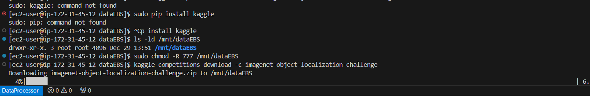
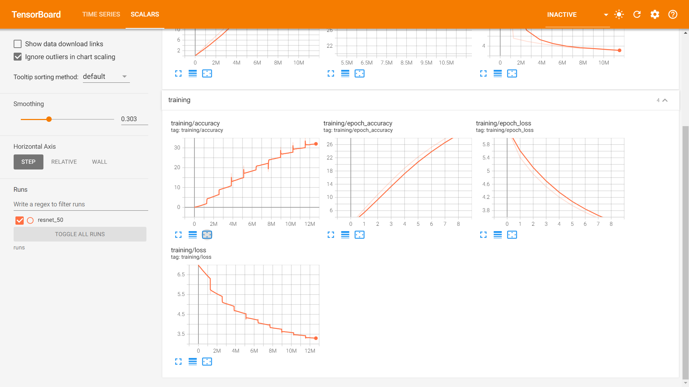
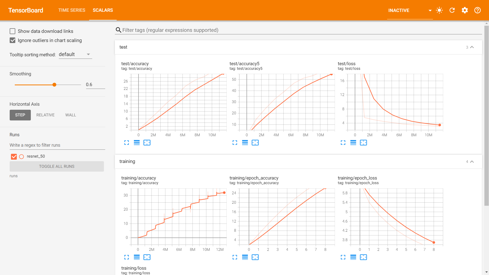

# Training ResNet50 on ImageNet-1k


## Dataset details

ImageNet-1k is a subset of the ImageNet dataset, containing 1000 classes with 1.2 million images. 

Kaggle link to the dataset: https://www.kaggle.com/datasets/c/imagenet-object-localization-challenge


Check [README.md](./utils/README.md) in the utils folder for more details.


## Model details

ResNet50 is a convolutional neural network that is 50 layers deep. It is a variant of the ResNet architecture, which is known for its depth and accuracy. ResNet50 has 49 layers in total, including the input layer, the output layer, and the convolutional layers in between.

Model loaded without pretrained weights.

[Models Store](https://huggingface.co/spaces/AravindKumarRajendran/ResNetonImageNet/tree/main/models)

Latest Model with 40% Accuracy trained for 15 epochs - [Link](https://huggingface.co/spaces/AravindKumarRajendran/ResNetonImageNet/blob/main/models/resnet_50.pth)


## How to run

```
pip install -r requirements.txt
```

```bash
python src/train_multi_gpu.py
```

## Images







## Results

We have started training the models with g4dn.2xlarge and that tooks around 40 hours for completing 10 epochs (close to 3.5 hours for 1 epoch). We have to choose this because we only had 16 vCPUs in our service quota.

I applied for more service quota while starting the training on above instance but did not receive it on time. 

Then I found that I had some more quota in other region. I moved the EBS volume to that region and started an instance with g5.12xlarge with 4 GPUs. I modified the code with multi-gpu support and started the training. I was taking around 30 minutes per epoch and ran for 15 epochs and achieved more than 40% accuracy. And we had to stop it there because it was already end of the day of 31st Dec (we only had credits till then).

## Hugging face space app

Visit the application at [[Resnet50 Classifier](https://huggingface.co/spaces/kishkath/Res-Imagenet)]
